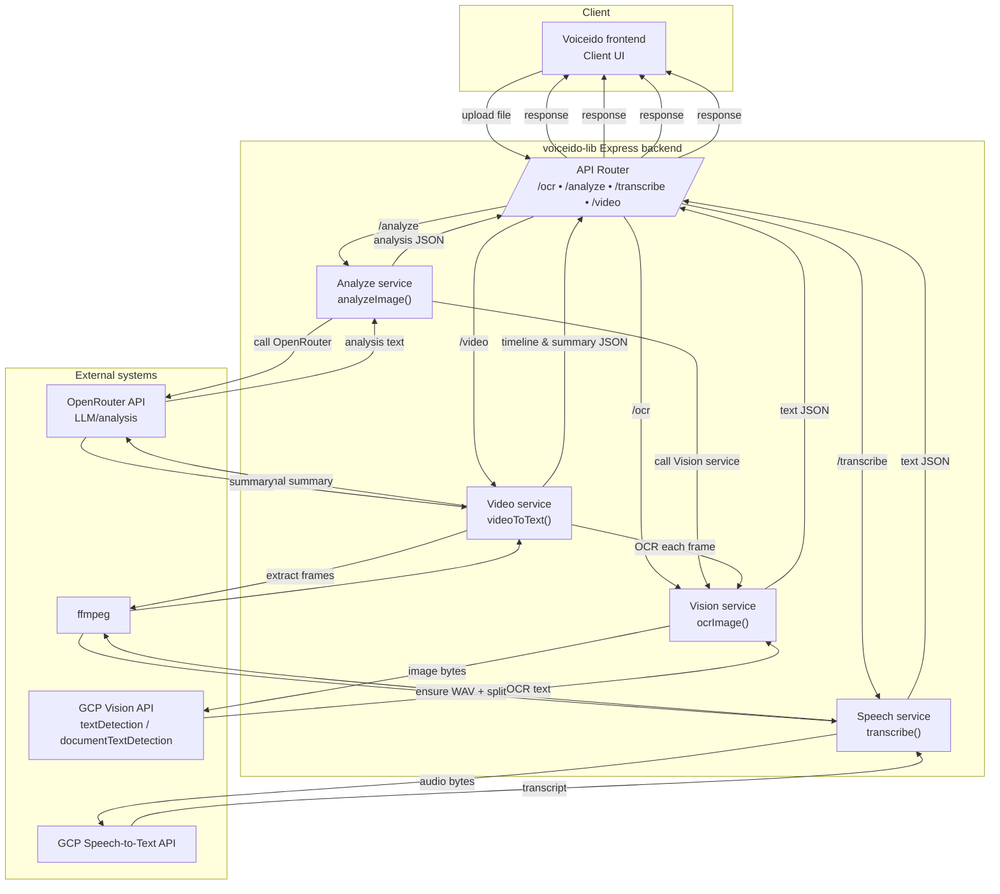

```mermaid
flowchart TD
    subgraph Client
        U["Voiceido frontend<br/>Client UI"]
    end
    subgraph Server["voiceido‑lib Express backend"]
        R[/API Router<br/>/ocr • /analyze • /transcribe • /video/]
        V["Vision service<br/>ocrImage()"]
        A["Analyze service<br/>analyzeImage()"]
        S["Speech service<br/>transcribe()"]
        Vid["Video service<br/>videoToText()"]
    end
    subgraph External["External systems"]
        GCPVision["GCP Vision API<br/>textDetection / documentTextDetection"]
        GCPSpeech["GCP Speech‑to‑Text API"]
        FFMPEGA[ffmpeg]
        OpenRouter["OpenRouter API<br/>LLM/analysis"]
    end

    U -- "upload file" --> R

    %% OCR pipeline
    R -->|"/ocr"| V
    V -->|image bytes| GCPVision
    GCPVision -->|OCR text| V
    V -->|text JSON| R
    R -->|response| U

    %% Analyze pipeline
    R -->|"/analyze"| A
    A -->|"call Vision service"| V
    A -->|"call OpenRouter"| OpenRouter
    OpenRouter -->|analysis text| A
    A -->|analysis JSON| R
    R -->|response| U

    %% Speech transcription pipeline
    R -->|"/transcribe"| S
    S -->|"ensure WAV + split"| FFMPEGA
    FFMPEGA --> S
    S -->|audio bytes| GCPSpeech
    GCPSpeech -->|transcript| S
    S -->|text JSON| R
    R -->|response| U

    %% Video OCR + summary pipeline
    R -->|"/video"| Vid
    Vid -->|"extract frames"| FFMPEGA
    FFMPEGA --> Vid
    Vid -->|"OCR each frame"| V
    Vid -->|"optional summary"| OpenRouter
    OpenRouter -->|summary| Vid
    Vid -->|"timeline & summary JSON"| R
    R -->|response| U
```
